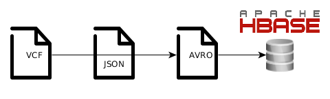

# cgs-data
Databases in CGS (HBase, MySQL, Metastore) + additional storage files (AVRO).
This package is part of the [**CGS**](https://github.com/jpoullet2000/cgs) project and aims to generate database "contents" in the Hadoop framework (based on the Cloudera distribution): table creation, data file conversions, table fields mapping, etc. 

**cgs-data** is

- *flexible*: any data structure can be imported into the CGS system (see [below](#dataStructure) for more info).  
- *extendable*: table generators can be written for any types of databases (so far we are compatible with MySQL and HBase, allowing the tsv format).   

More specifically this document describes the data in CGS, how they are created, how they are stored. Scripts to import data into the different tables are available and are described below. 

Clinical data are stored in MySQL tables. 
Genomics/Exomics data are stored in HBase (accessible via Hive Metastore) and in AVRO files.

To generate the tables one needs the corresponding rights to do so. 

For the moment, only variant information is meant to be stored in HBase and AVRO files (see [here](http://avro.apache.org/docs/1.3.0/) for more details about the AVRO format).  

## <a name="dataStructure">Generation of data structure in CGS</a> 
The main goal of this package is to be usable for any type of data schemas. If you are not happy with the data structures proposed, you just need to make your own.
It is simple, you just need to edit some configuration files. How does it work? A parser reads a config file which tells what are the data substructures that have to be created, their types (HBase, MySQL, etc), the files where to find the information (source files). A data substructure can be for instance some tables in MySQL or one table in HBase, etc. There is no restrictions about a data substructure except that all the tables it contains should belong to the same database. Then it connects to your Hadoop cluster/machine (can be done locally) and installs the different data substructures as defined in your config file. The description of the config file can be found in the subsection [Config file](#configFile). Connections between tables are likely to happen and corresponding field names may be confusing. We consider 2 levels of mapping or relationships between fields in our data structure: relationships within a data substructure and relationships between data substructures. Relationships *within* a data substructure are defined in the source file corresponding to that substructure, whereas the relationships between data substructures are defined in a separate file called *reference.yml*.
For instance, the "sample_ID" field in a metastore table may corresponds to the "ID" field in your MySQL "sample" table, this is a *"between"* relationship. A description of the reference file can be found in the subsection [File with reference fields](#referenceFile). All files for one data structure are located in one folder: config file, reference file, source files. Some more information about the organization within this folder can be found in the subsection [Data structure folder tree](#datastructureTree). 


### <a name="datastructureTree">Data structure folder tree</a>
As mentioned previously, all files specific to a data structure are located in the same folder which has the name of the data structure. Here is an example of files that you will find in the *variants* data structure:
```
.
+-- config.yml
+-- reference.yml
+-- sourceFiles
	+-- variants_hbase.yml
	+-- variants_metastore.yml
	+-- variants_api.yml
	+-- clinical_mysql.sql
	+-- ...
```

### <a name="configFile">Config file</a>
The config file is a YAML file with the following structure:

```
dataStructureName: variants
substructures:
	- name: clinical
      type: mysql
      description: clinical/phenomic database
      database: default
      source: clinical.sql
	  host: localhost
	  user: admin 
	  password: admin

	- name: variants_hbase
      type: hbase
      description: variants table
      database: default
      source: variants_hbase.yml
	  host: 192.168.1.42
	  user: admin 
	  password: admin

	- name: variants_metastore
	  type: metastore
	  description: variants in hive metastore
	  database: default
	  source: variants_metastore.yml
	  host: 192.168.1.42
	  user: admin 
	  password: admin

	- name: variants_api
	  type: api
	  description: variants resource available through API
	  database: NULL
	  source: variants_api.yml
	  host: 192.168.1.42
	  user: admin 
	  password: admin

```

where

- *dataStructureName* is the name of the data structure and thus the name of the folder
- *name* is the data substructure name
- *type* is the data substructure type (HBase, MySQL, metastore, AVRO)
- *description* is the description of the data substructure
- *database* is the database name where to add the table
- *source* is the data file where the data substructure is defined
- *host* is the ip/url of the host machine
- *user* is the user to connect to the database 
- *password* is the user password to connect to the database

No database will be created or updated for the API resources. The corresponding yaml file (here *variants_api.yml*) will be copied on the machine in the *~/.cgs* directory of the machine.
This is used for mapping API resources to fields in our data structure. 
Note that all info about the data substructures will be copied in a configuration file in`~/.cgs/cgs_config_file`. This file should be protected (ex: `chmod 600 ~/.cgs/cgs_config_file`. Here is how the file will look like:
```
[clinical]
type=mysql
database=default
host=localhost
port=3306
user=admin
password=admin
[variants_hbase]
type=hbase
database=default
host=localhost
port=60000
user=admin
password=admin
```


### <a name="referenceFile">File with reference fields</a>
The reference file is a yaml file with the following structure:

```
<variable>:
	description: <description>
	substructures:
		- <data_substructure>: <field_name>
		- <data_substructure>: <field_name>
		- ...
<variable>:
	description: <description>
	substructures:
		- <data_substructure>: <field_name>
		- <data_substructure>: <field_name>
		- ...
```

Here is a small example for illustration:

```
gene_symbol:
	description: "Gene symbol."
	substructures:
	  - variants_api: variants.info.gene_symbol
	  - variants_metastore: variants.info.gene_symbol
	  - variants_hbase: R.GS
pos:
	description: "Position : chromosome and position gives the contig on which the variant occurs. For indels this is actually the base preceding the event."
	substructures:
	  - variants_api: variants.start
	  - variants_metastore: variants.start
	  - variants_hbase: R.P
project_sample_id:
	description: "ID of the sample in the project."
	substructures:
	  - variants_api: readGroupSets.readGroups.sampleID 
	  - variants_metastore: readGroupSets.readGroups.sampleID
	  - variants_hbase: R.SI
	  - clinical_mysql: sample.sample_id

```

where
- **description**: description of the field/variable (string, *mandatory*),
- **substructures**: data substructure names where the field/variable is found, names should be the same as in the config file *config.yml* (string, *mandatory*),

	* The field name is (usually) a construction of `<table_name>.<field>` (string, *mandatory*).

The goal of this file is to list all fields common to different data substructures. For instance, the field *R.SI* in HBase and the field *sample.sample_id* in MySQL are refering to the same thing, which is the project_sample_id. 


### <a name="referenceFile">Source files for table generation</a>
The source files are located in the folder *sourceFiles* of the corresponding data structure folder. 
The syntax to be used in these files depends on the type of the table/schema (HBase, MySQL, Metastore, AVRO, etc).
We detail the syntax for:

- [HBase](#hbaseSource)
- [MySQL](#mysqlSource)
- [Metastore](#metastoreSource)
- [AVRO](#avroSource)
- [API](#apiResources)


in the following subsections.

#### <a name="hbaseSource">HBase table definition and generation</a>
A source file for HBase is a yaml file with the following structure:

```
<table_name>:
	- <column_family>:
	  - <column_name>:
		type: <type>
		description: <description> 
	  - <column_name>:
		type: <type>
		description: <description>
	  - ...
	- <column_family>:
	  - <column_name>:
		type: <type>
		description: <description>
	- ...	
<table_name>:
	- <column_family>:
	  - <column_name>:
		type: <type>
		description: <description>
```

Here is an small example for illustration: 
```
variants:
	- R:
	  - SI:
		type: string
		description: "sample id"
	  - GS:
		type: string
		description: "gene symbol"
	- I:
	  - SB:
		type: float
		description: "strand bias"
```

where

- *table_name*: table name in HBase (string)
- *type*: type of the field (string)
- *description*: description of the field (string)

#### <a name="mysqlSource">MySQL table definition and generation</a>
For MySQL, there are 2 possibilities of format, either *.sql* or *.yml*.
The *.sql* is the one you can get when exporting data or schema from MySQL when you use the `--no-data` option.
The *.yml* is largely inspired from the [*doctrine*](http://doctrine.readthedocs.org/) project and should be similar to this (all options are not mentioned here):

```
<table_name>:
	columns:
		<column_name>:
			type: <type>
			primary: <true/false>
			autoincrement: <true/false>
		<column_name>:
			type: <type>
			relations:
				<foreign_table_name>:
					foreign: <foreign_column_name>
<table_name>:
	columns:
		<column_name>:
			type: <type>
			primary: <true/false>
			autoincrement: <true/false>
...		
```

Here is a small example for illustration:

```
sample:
	columns:
		sample_id:
			type: integer
			primary: true
			autoincrement: true
		patient_id:
			type: integer
			relations:
				patient:
					foreign: patient_id

patient:
	columns:
		patient_id:
			type: integer
		patient_name:
			type: string

```

In the example above, we have 2 tables *sample* and *patient* with a 1-to-M relationship between *patient_id* and *sample_id*, meaning that multiple *sample_id* can be found for the same *patient_id*. 

#### <a name="metastoreSource">Metastore table definition and generation</a>
The source file is *.yml* comparable to what we have for MySQL (see the [MySQL subsection](#mysqlSource)).

#### <a name="avroSource">AVRO schema</a>
An AVRO schema is not per se a table in a database but a file with the extension *.avsc*. More documentation about the format of schema in AVRO can be found [here](http://avro.apache.org/docs/1.7.7/spec.html). 

#### <a name="apiResources">API resources</a>
The source file is *.yml* comparable to what we have for MySQL (see the [MySQL subsection](#mysqlSource)).

## Importing data into CGS
Both clinical and genomic data can be imported in CGS.
Clinical data do not require specific processing and can be added into relational databases on the fly. On the other hand genomics data requires additional processing to be uploaded into CGS.
In the CGS data structure called 'cgs-data-variants', genomics data are stored in HBase and are coming from VCF files.
The data workflow for the VCF files is the following:



The VCF file is first converted into a JSON file, which is converted into an AVRO file as explained in the subsection [Conversion of VCF files to AVRO](#vcf2avro).
Once the AVRO files are generated, they are uploaded into HBase (using Bulk load) as described in subsection [Bulk load of AVRO files into HBase](#avro2hbase).
A Hive metastore is built on top of HBase as defined in subsection [Metastore table definition on top of HBase](#metastoreOnHBase).

### <a name="vcf2avro"> Conversion of VCF files to AVRO </a>
The conversion of the VCF files into AVRO files is done in 2 steps:

- first, the VCF files are converted into a JSON format
- second, the JSON files are converted into AVRO.

The AVRO files are stored in HDFS, whereas the JSON files are deleted on the fly (by default).

The AVRO format has the advantage of being extendable and changeable without breaking anything.
If tomorrow, one decide to migrate from HBase to another NoSQL solution, it can start back from the AVRO files.
Similarly, if fields names change or the field structure is re-thought, the AVRO format is a convenient solution.


### <a name="avro2hbase"> Bulk load of AVRO files into HBase </a>
Under development.

### <a name="metastoreOnHBase"> Metastore table definition on top of HBase (accessible via Hive, Pig, Impala, etc)
Under development.

## Implementing security in HBase
Under development.
